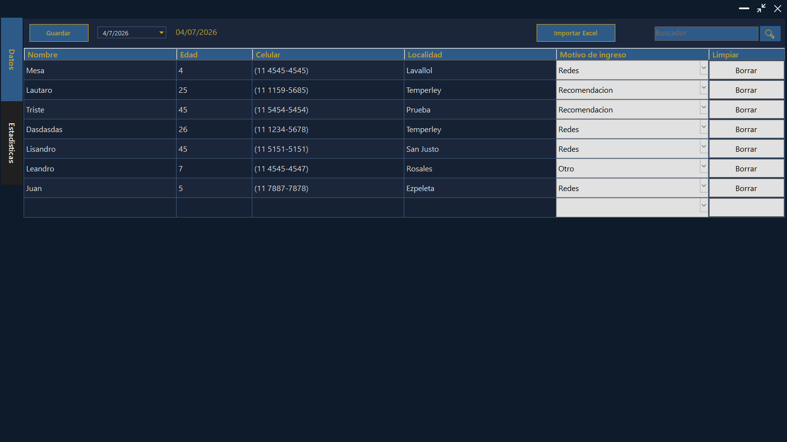
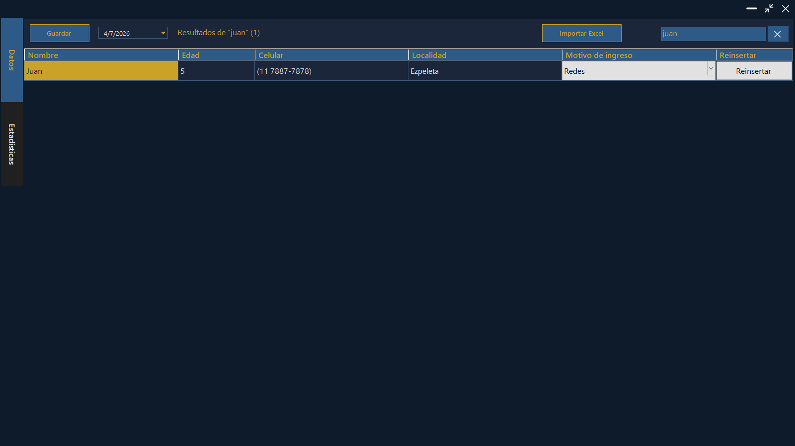
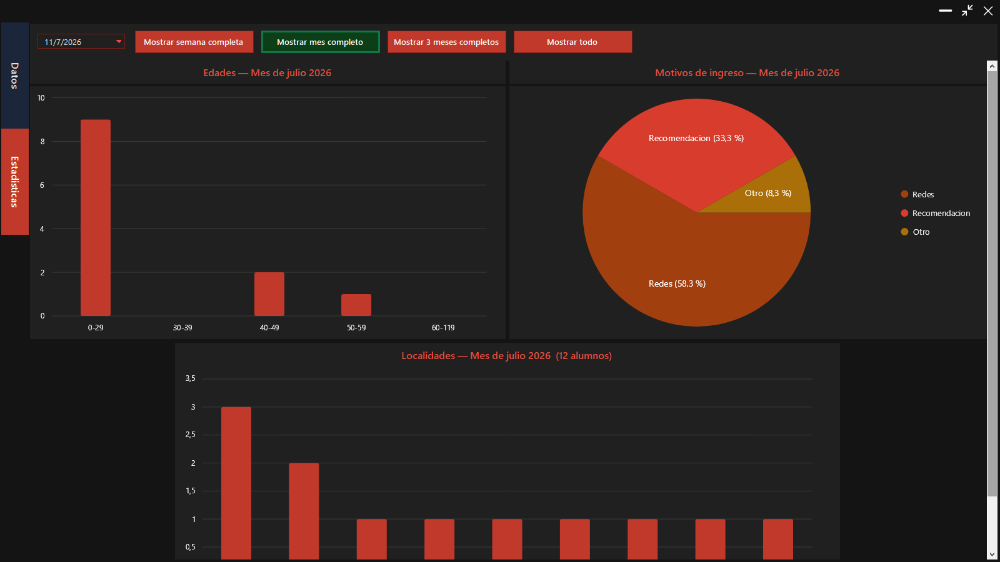
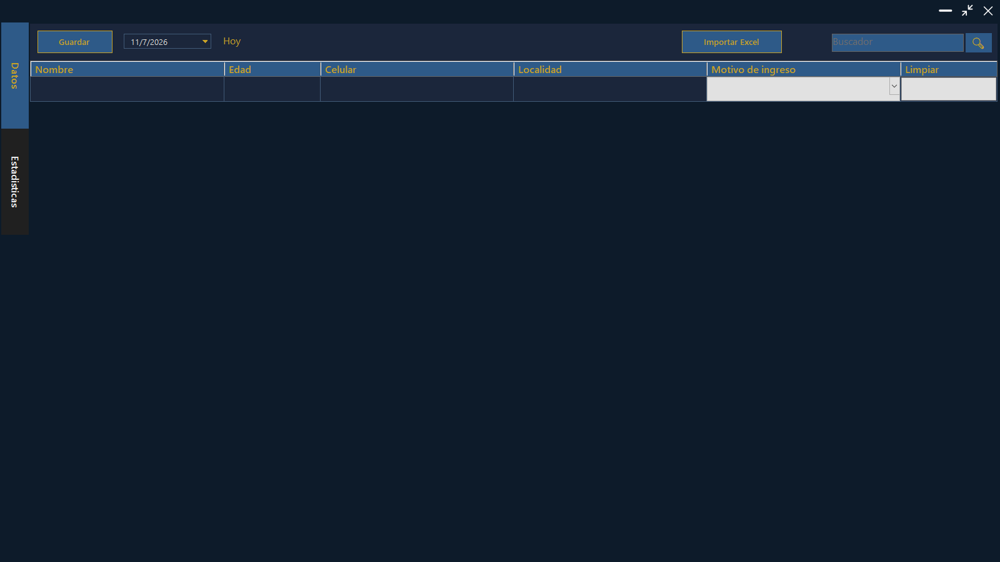

# 📊 Datos y Estadísticas

Aplicación de escritorio para **Windows** (WinForms, .NET 10) que registra alumnos día a día y genera estadísticas visuales sobre ellos. Pensada para llevar el control de inscripciones a clases: quiénes se anotaron, de dónde vienen, qué edades tienen y cómo se enteraron de las clases.

Todo con una estética **oscura y personalizada** (azul/dorado para la carga de datos, rojo/negro para las estadísticas), controles propios y persistencia local en SQLite — no necesita servidor ni conexión a internet.

---

## 📸 Capturas

### Pestaña Datos — carga y edición con validación en vivo



### Búsqueda en toda la base



### Pestaña Estadísticas — gráficos por período



### Un día nuevo, listo para cargar



---

## ✨ Funcionalidades

### Pestaña **Datos** (carga y edición)

- **Grilla editable por fecha**: cada día tiene su propia lista de alumnos (nombre, edad, celular, localidad y motivo de ingreso).
- **Validación en vivo**: las celdas con datos inválidos se pintan de rojo y muestran un mensaje específico de qué está mal.
  - Edad: solo números, entre 2 y 120.
  - Celular: se normaliza automáticamente al formato `(11 XXXX-XXXX)` acepte como acepte el número (con guiones, espacios, con o sin código de área).
  - Localidad: se capitaliza automáticamente (`san isidro` → `San Isidro`).
- **Autocompletado de localidades** con desplegable oscuro propio, alimentado por las localidades ya guardadas en la base.
- **Búsqueda** de alumnos en toda la base, con posibilidad de editar los resultados o reinsertarlos en el día actual.
- **Importación desde Excel** (`.xlsx` / `.xlsm`): lee el archivo, valida cada fila y vuelca los alumnos en la grilla.
- **Control de cambios sin guardar**: la interfaz siempre sabe si hay ediciones pendientes y avisa antes de perderlas (al cambiar de fecha, buscar o cerrar).

### Pestaña **Estadísticas** (visualización)

- **Tres gráficos** hechos con LiveCharts2:
  - Barras de alumnos por **localidad**.
  - Barras de alumnos por **rango de edad** (0-29, 30-39, 40-49, 50-59, 60+).
  - Torta de alumnos por **motivo de ingreso** (Redes / Recomendación / Volantes / Otro).
- **Períodos configurables**: un día puntual, la semana, el mes, los últimos 3 meses o toda la base, con botones que funcionan como interruptores excluyentes.

---

## 🛠️ Tecnologías

| Tecnología | Uso |
|---|---|
| [.NET 10](https://dotnet.microsoft.com/) + Windows Forms | Interfaz de escritorio |
| [Microsoft.Data.Sqlite](https://www.nuget.org/packages/Microsoft.Data.Sqlite) | Base de datos local (`alumnos.db`, se crea sola al lado del ejecutable) |
| [LiveChartsCore.SkiaSharpView.WinForms](https://livecharts.dev/) | Gráficos de barras y torta |
| [ClosedXML](https://github.com/ClosedXML/ClosedXML) | Lectura de archivos Excel |

---

## 🚀 Cómo ejecutarlo

### Opción A: descargar el ejecutable (sin instalar nada)

Bajá el `.zip` de la [última release](https://github.com/lauti-g/datos_y_estadisticas/releases/latest), descomprimilo y ejecutá `datos_y_estadisticas.exe`. Es autocontenido: no requiere tener .NET instalado.

### Opción B: compilar desde el código

**Requisitos**: Windows + [SDK de .NET 10](https://dotnet.microsoft.com/download).

```bash
# Clonar el repositorio
git clone https://github.com/lauti-g/datos_y_estadisticas.git
cd datos_y_estadisticas

# Compilar y ejecutar
dotnet run
```

La primera vez que corre crea la base `alumnos.db` en la carpeta del ejecutable. No hay que configurar nada más.

> 💡 También se puede abrir la solución (`datos_y_estadisticas.slnx`) con Visual Studio 2026 y ejecutar con F5.

---

## 📥 Formato del Excel para importar

El importador espera las columnas en este orden (con fila de encabezado):

| A | B | C | D | E |
|---|---|---|---|---|
| Nombre | Edad | Celular | Localidad | Motivo de ingreso |

Si tu archivo tiene otro orden, se ajusta cambiando las constantes `COL_*` en `ImportadorExcel.cs`.

---

## 📁 Estructura del proyecto

El código está organizado **en capas**: cada carpeta agrupa archivos con la misma responsabilidad, y el namespace de cada clase coincide con su carpeta.

```
datos_y_estadisticas/
├── Program.cs        → punto de entrada
├── Modelos/          → las clases de datos
├── Datos/            → acceso a SQLite y lectura de Excel
├── Logica/           → reglas puras (sin interfaz)
└── UI/               → todo lo visual
    ├── Controles/    → controles a medida con estilo oscuro
    └── Formularios/  → las ventanas
```

| Archivo | Responsabilidad |
|---|---|
| `Modelos/Alumno.cs` | El modelo: una fila de la tabla |
| `Datos/RepositorioAlumnos.cs` | Única clase que habla con SQLite (guardar, leer, buscar) |
| `Datos/ImportadorExcel.cs` | Diálogo de selección + lectura del Excel |
| `Logica/Validaciones.cs` | Reglas de validación y normalización (edad, celular, localidad) |
| `Logica/MaquinaEstadoDatos.cs` | Máquina de estados de la grilla (normal / con cambios / búsqueda) |
| `UI/Formularios/FormPrincipal.cs` | Coordinador: crea los módulos al arrancar, los conecta entre sí y maneja la ventana (barra de título propia, redimensionado) |
| `UI/Formularios/DialogoSalida.cs` | Ventana de confirmación al salir con cambios sin guardar |
| `UI/ValidacionGrilla.cs` | Aplica las reglas de `Validaciones` sobre la grilla y pinta los errores |
| `UI/GraficosEstadisticas.cs` | Todo el dibujo con LiveCharts (si se cambia la librería de gráficos, se toca solo este archivo) |
| `UI/SelectorModoEstadistica.cs` | Botones Semana/Mes/3 meses/Todo y cálculo de rangos de fechas |
| `UI/ControladorFechas.cs` | Los dos selectores de fecha, distinguiendo cambios del usuario vs. del código |
| `UI/Tema.cs` | Paleta de colores centralizada |
| `UI/Controles/` | `DateTimePickerOscuro`, `TabControlOscuro` y `AutocompletadoOscuro`: controles propios con estilo oscuro |

---

## 👤 Autor

**Lautaro Gauna** — [@lauti-g](https://github.com/lauti-g)
